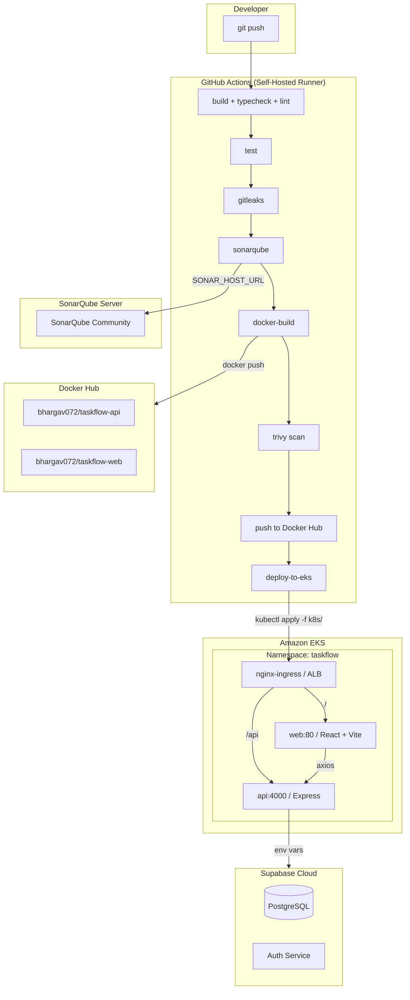

<h1 align="center">TaskFlow</h1>
<p align="center">Human-First Task Management -- CI/CD Pipeline on Amazon EKS</p>

<p align="center">
  
  
  
  
  
  
  
  
  
  
</p>

---

## Table of Contents

1. Overview
2. Architecture
3. CI/CD Pipeline
4. Setup Guide
5. Destroy (Clean Up)
6. Cost Reference
7. Tech Stack
8. Resolved Issues
9. License

---

## Overview

TaskFlow is a task management application built with React + Vite (frontend) and Express + TypeScript (backend), using Supabase for database and authentication. The project is structured as an npm workspaces monorepo with shared types.

The key deliverable is a fully automated CI/CD pipeline using GitHub Actions (self-hosted runner) that builds, tests, scans, and deploys the application to Amazon EKS with zero manual intervention after the initial cluster setup.

Monorepo structure:

```
project-2-task-flow/
├── apps/
│   ├── api/              Express + TypeScript (port 4000)
│   └── web/              React + Vite (port 80)
├── packages/
│   └── shared/           Shared types, utilities
├── k8s/                  Kubernetes manifests
│   ├── namespace.yaml
│   ├── api-deployment.yaml
│   ├── api-service.yaml
│   ├── web-deployment.yaml
│   ├── web-service.yaml
│   └── ingress.yaml
├── .github/workflows/    CI/CD pipeline definition
├── docker-compose.yml    Local development
└── sonar-project.properties
```

---

## Architecture



Data Flow:
1. Developer pushes code to GitHub
2. Self-hosted runner executes 8-stage pipeline (build -> test -> gitleaks -> sonarqube -> docker-build -> trivy -> push -> deploy)
3. Docker images are pushed to Docker Hub with version tag + latest
4. EKS deployment applies Kubernetes manifests and updates pod images
5. nginx-ingress controller (backed by AWS ALB) routes traffic to web (/) and api (/api)
6. API connects to Supabase Cloud for database and authentication

---

## CI/CD Pipeline


| Stage | Job | Tool/Action | Purpose |
|-------|-----|-------------|---------|
| 1 | build | actions/setup-node@v4 | npm ci, typecheck, lint |
| 2 | test | vitest | Unit + integration tests |
| 3 | gitleaks | gitleaks/gitleaks-action@v2 | Scan git history for secrets |
| 4 | sonarqube | sonarsource/sonarqube-scan-action@v5 | Code quality analysis (self-hosted) |
| 5 | docker-build | docker/build-push-action@v6 | Multi-stage image build |
| 6 | trivy | aquasecurity/trivy-action@v0.35.0 | Vulnerability scan (HIGH, CRITICAL) |
| 7 | push-to-dockerhub | docker/login-action@v3 | Push version tag + latest to Docker Hub |
| 8 | deploy-to-eks | aws-actions/configure-aws-credentials@v4 | kubectl apply + set image on EKS |

Triggers:
- Code pushes and PRs trigger Stages 1-6 (build through scan)
- Docker push and EKS deploy (Stages 7-8) run only on manual workflow_dispatch from GitHub UI
- User enters a version string (e.g., v1.1) which becomes the Docker image tag

---

## Setup Guide

This guide covers the complete infrastructure setup in three parts:
1. GitHub Runner VM (the machine that runs CI/CD jobs)
2. SonarQube VM (code quality server)
3. EKS cluster and application deployment

---

### 1. GitHub Runner VM Setup

Launch an Ubuntu 22.04 VM (t3.medium or larger) with a security group allowing ports 22 and 3000-10000.

**Step 1.1 -- Install Docker**

```bash
sudo apt update && sudo apt install -y docker.io
sudo systemctl enable docker
sudo usermod -aG docker ubuntu
newgrp docker
docker --version
```

**Step 1.2 -- Install AWS CLI v2**

```bash
curl "https://awscli.amazonaws.com/awscli-exe-linux-x86_64.zip" -o "awscliv2.zip"
unzip awscliv2.zip
sudo ./aws/install
rm -rf aws awscliv2.zip
aws --version
```

**Step 1.3 -- Install kubectl**

```bash
curl -O https://dl.k8s.io/release/v1.30.0/bin/linux/amd64/kubectl
chmod +x kubectl
sudo mv kubectl /usr/local/bin/
kubectl version --client
```

**Step 1.4 -- Register GitHub Self-Hosted Runner**

Go to GitHub repo -> Settings -> Actions -> Runners -> New runner -> Linux. Copy the token from the page.

```bash
mkdir actions-runner && cd actions-runner
curl -o actions-runner-linux-x64-2.322.0.tar.gz -L \
  https://github.com/actions/runner/releases/download/v2.322.0/actions-runner-linux-x64-2.322.0.tar.gz
tar xzf actions-runner-linux-x64-2.322.0.tar.gz
./config.sh --url https://github.com/munnavuyyuru/CICD-Projects --token <TOKEN_FROM_GITHUB>
sudo ./svc.sh install
sudo ./svc.sh start
```

**Step 1.5 -- Verify Runner is Online**

GitHub repo -> Settings -> Actions -> Runners -> the runner should show a green "Idle" status.

---

### 2. SonarQube Setup

Launch a second Ubuntu VM (t3.medium) with a security group allowing port 9000 from the runner VM IP.

**Step 2.1 -- Run SonarQube Container**

```bash
docker run -d --name sonarqube \
  -p 9000:9000 \
  -e SONAR_ES_BOOTSTRAP_CHECKS_DISABLE=true \
  sonarqube:community
```

**Step 2.2 -- Verify SonarQube is Running**

```bash
docker logs sonarqube -f
```

Wait until you see "SonarQube is operational" in the logs.

```bash
curl http://localhost:9000
```

**Step 2.3 -- Create Project and Token**

1. Open `http://<sonar_ip>:9000` in a browser.
2. Log in with default credentials: admin / admin.
3. Change the password when prompted.
4. Create a new project named `taskflow`.
5. Generate a token (name it `taskflow-token`) and copy the token value.

**Step 2.4 -- Add GitHub Secrets**

Go to GitHub repo -> Settings -> Secrets and variables -> Actions and add these secrets:

| Secret Name | Value |
|-------------|-------|
| `SONAR_TOKEN` | The token generated in step 2.3 |
| `SONAR_HOST_URL` | `http://<sonar_ip>:9000` |

---

### 3. EKS and Kubernetes Setup

Run these commands from your local machine (where eksctl, kubectl, and Helm are installed).

**Step 3.1 -- Create EKS Cluster**

```bash
eksctl create cluster --name taskflow-cluster --region ap-south-1 \
  --nodegroup-name standard-workers --node-type t3.medium --nodes 2 --managed
```

This takes 15-20 minutes.

**Step 3.2 -- Create Namespace and Supabase Secret**

```bash
kubectl create ns taskflow

kubectl create secret generic supabase-secret -n taskflow \
  --from-literal=supabase-url=https://njeyfigatkewnmcbkajg.supabase.co \
  --from-literal=supabase-service-role-key=<SUPABASE_SERVICE_ROLE_KEY> \
  --from-literal=supabase-anon-key=<SUPABASE_ANON_KEY>
```

**Step 3.3 -- Install nginx-ingress Controller**

```bash
helm repo add ingress-nginx https://kubernetes.github.io/ingress-nginx
helm install ingress-nginx ingress-nginx/ingress-nginx \
  --namespace ingress-nginx --create-namespace
```

**Step 3.4 -- Deploy Application to EKS**

```bash
kubectl apply -f k8s/
```

**Step 3.5 -- Verify Deployment**

```bash
kubectl get pods -n taskflow
kubectl get ingress -n taskflow
kubectl get svc -n ingress-nginx ingress-nginx-controller \
  -o jsonpath="{.status.loadBalancer.ingress[0].hostname}"
```

**Step 3.6 -- Trigger Pipeline Release**

Go to GitHub UI -> Actions -> Task Flow -> Run workflow -> enter a version tag (e.g., v1).

The pipeline runs all 8 stages automatically:
build -> test -> gitleaks -> sonarqube -> docker-build -> trivy -> push-to-dockerhub -> deploy-to-eks

---

## Destroy (Clean Up)

To avoid ongoing AWS costs, tear down the entire stack:

```bash
# 1. Delete Kubernetes resources
kubectl delete -f k8s/

# 2. Uninstall nginx-ingress
helm uninstall ingress-nginx -n ingress-nginx
kubectl delete ns ingress-nginx

# 3. Delete namespace
kubectl delete ns taskflow

# 4. Delete EKS cluster (removes nodes, VPC, subnets, load balancers, EBS volumes)
eksctl delete cluster --name taskflow-cluster --region ap-south-1

# 5. Verify cleanup
kubectl config get-contexts
```

Checklist Before Destroy:
- Docker Hub images pushed (latest version saved externally)
- SonarQube data backed up (if needed)
- GitHub runner deregistered (Settings -> Actions -> Runners -> Remove)
- EBS snapshots taken (if persistent data needed)

---

## Cost Reference

| Resource | Monthly Cost | Reclaim Strategy |
|----------|-------------|------------------|
| EKS cluster (2 x t3.medium) | ~$75 | eksctl delete cluster |
| nginx-ingress ALB | ~$18 | Auto-deleted with cluster |
| SonarQube VM (t3.medium) | ~$30 | Stop or terminate |
| EBS volumes (gp3) | ~$1 | Auto-deleted |
| Total | ~$124 | |

---

## Tech Stack

| Category | Technology |
|----------|-----------|
| Frontend | React, Vite, TypeScript, Tailwind CSS |
| Backend | Express, TypeScript, Zod validation |
| Shared | TypeScript types and utilities (npm workspace) |
| Database | Supabase (PostgreSQL, cloud-hosted) |
| Auth | Supabase Auth |
| Container | Docker multi-stage builds (node:22-alpine) |
| CI/CD | GitHub Actions (self-hosted Ubuntu runner) |
| Secrets Scan | Gitleaks |
| Code Quality | SonarQube Community (self-hosted) |
| Vulnerability Scan | Trivy (HIGH, CRITICAL severity) |
| Image Registry | Docker Hub (bhargav072/taskflow-*) |
| Orchestration | Amazon EKS (Kubernetes) |
| Ingress | nginx-ingress controller (AWS ALB) |
| IaC/CLI | eksctl, kubectl, Helm, AWS CLI v2 |

---

## Resolved Issues

### 1. API Container Crash - ESM Module Imports

The API container exited immediately with `ERR_MODULE_NOT_FOUND` for `/app/apps/api/dist/config`. The compiled JavaScript used extensionless relative imports like `import { config } from './config'` while Node.js ESM mode strictly requires `.js` extension.

Root Cause: The TypeScript config used `moduleResolution: "bundler"` which outputs imports without extensions -- fine for bundlers like Vite, but Node.js runtime rejects them.

Solution: Replaced the `tsc` build with `tsup`, a bundler that produces a single-file ESM output with all dependencies resolved.

```
apps/api/package.json - added tsup to devDependencies
apps/api/Dockerfile - simplified to single-stage build

build command changed from: tsc
to: tsup src/index.ts --format esm --platform node --out-dir dist
```

---

### 2. API Container Crash - WebSocket Not Found

Supabase realtime client threw `Error: Node.js detected but native WebSocket not found` at startup.

Root Cause: The `@supabase/realtime-js` package requires Node.js 22+ for native WebSocket support, but the Docker image was using `node:20-alpine`.

Solution: Upgraded the base image from `node:20-alpine` to `node:22-alpine`.

```bash
# Dockerfile base image changed
FROM node:22-alpine
```

---

### 3. Web Container - nginx Host Not Found

nginx failed with `host not found in upstream "api"` and exited immediately.

Root Cause: nginx resolves upstream hostnames at startup time using static DNS. The API container had exited (from other errors), so Docker DNS had no record for "api". Even with a healthy API, a brief startup race could trigger this.

Solution: Added Docker's internal DNS resolver (`127.0.0.11`) and a dynamic upstream variable so nginx re-resolves at request time.

```nginx
resolver 127.0.0.11 valid=30s;

location /api {
    set $api_upstream http://api:4000;
    proxy_pass $api_upstream;
}
```

---

### 4. Web Container - Exit 127 Command Not Found

Web container exited with exit code 127 -- `npm: not found`.

Root Cause: The docker-compose file overrode the nginx CMD with `npm run dev -w apps/web`, but nginx:alpine has no Node.js runtime.

Solution: Removed the command override from docker-compose. The web container now uses its production CMD (`nginx -g daemon off;`), serving the pre-built static files from the multi-stage build.

---

### 5. Supabase Migration Failure

Local supabase/postgres container failed on migration with `ERROR: role "supabase_admin" does not exist`.

Root Cause: The supabase/postgres image requires a `supabase_admin` role for running extensions like pgcrypto, but the default postgres user doesn't have it.

Solution: Removed the local supabase service from docker-compose entirely. The application now connects directly to Supabase Cloud for database and authentication.

---

### 6. AWS CLI Not Found on Runner

The deploy job failed with `aws: command not found`.

Root Cause: The GitHub self-hosted runner VM did not have AWS CLI installed.

Solution: Installed AWS CLI v2 on the runner.

```bash
curl "https://awscli.amazonaws.com/awscli-exe-linux-x86_64.zip" -o "awscliv2.zip"
unzip awscliv2.zip
sudo ./aws/install
rm -rf aws awscliv2.zip
aws --version
```

---

### 7. OIDC Authentication Denied

The deploy job failed with `AccessDeniedException: User is not authorized to perform eks:DescribeCluster`.

Root Cause: The OIDC IAM role (`github-actions-eks-role`) only had `AmazonEKSClusterPolicy` attached, which does not include `eks:DescribeCluster` -- the permission needed by `aws eks update-kubeconfig`.

Solution: Created an inline IAM policy with the required permissions.

```json
{
    "Version": "2012-10-17",
    "Statement": [
        {
            "Effect": "Allow",
            "Action": [
                "eks:DescribeCluster",
                "eks:AccessKubernetesApi"
            ],
            "Resource": "*"
        }
    ]
}
```

---

### 8. EKS Access Entry Missing

OIDC authentication succeeded (IAM), but Kubernetes API calls returned forbidden.

Root Cause: The IAM role was not registered in EKS access entries, so Kubernetes had no mapping for the IAM principal.

Solution: Created an access entry and associated the cluster admin policy.

```bash
aws eks create-access-entry \
  --cluster-name taskflow-cluster \
  --principal-arn arn:aws:iam::505017489291:role/github-actions-eks-role \
  --region ap-south-1

aws eks associate-access-policy \
  --cluster-name taskflow-cluster \
  --principal-arn arn:aws:iam::505017489291:role/github-actions-eks-role \
  --policy-arn arn:aws:eks::aws:cluster-access-policy/AmazonEKSClusterAdminPolicy \
  --access-scope type=cluster \
  --region ap-south-1
```

---

### 9. OIDC Credentials Could Not Be Loaded

The `aws-actions/configure-aws-credentials` action returned `Could not load credentials from any providers`.

Root Cause: The workflow was missing the `id-token: write` permission, which is required for GitHub to issue an OIDC token to the runner.

Solution: Added the permissions block at the workflow level.

```yaml
permissions:
  id-token: write
  contents: read
```

---

### 10. kubectl Not Found on Runner

The deploy job failed with `kubectl: command not found`.

Root Cause: The self-hosted runner VM did not have kubectl installed.

Solution: Installed kubectl on the runner.

```bash
curl -O https://dl.k8s.io/release/v1.30.0/bin/linux/amd64/kubectl
chmod +x kubectl
sudo mv kubectl /usr/local/bin/
kubectl version --client
```

---

### 11. Supabase Secret Already Exists

The deploy job step failed with `Error: failed to create secret secrets "supabase-secret" already exists`.

Root Cause: The `kubectl apply` command had a conflict with the existing secret's stored configuration.

Solution: Changed the command to properly quote the secret values.

```bash
kubectl create secret generic supabase-secret \
  -n taskflow \
  --from-literal=supabase-url="${{ secrets.SUPABASE_URL }}" \
  --from-literal=supabase-service-role-key="${{ secrets.SUPABASE_SERVICE_ROLE_KEY }}" \
  --from-literal=supabase-anon-key="${{ secrets.SUPABASE_ANON_KEY }}" \
  --dry-run=client -o yaml | kubectl apply -f -
```

---

### 12. Kubernetes Manifest Path Not Found

The deploy job failed with `error: the path "project-2-task-flow/k8s/" does not exist`.

Root Cause: The workflow had `defaults.run.working-directory: project-2-task-flow`, so `kubectl apply -f project-2-task-flow/k8s/` resolved to `project-2-task-flow/project-2-task-flow/k8s/` (double nesting).

Solution: Changed to a relative path that works within the configured working directory.

```bash
kubectl apply -f k8s/
```

---

### 13. SonarQube - sonar.projectKey Not Defined

The SonarQube scanner failed with `You must define the following mandatory properties for 'Unknown': sonar.projectKey`.

Root Cause: The scanner ran from the CI-CD repository root, but the `sonar-project.properties` file was inside the `project-2-task-flow/` subdirectory.

Solution: Added `projectBaseDir: project-2-task-flow` to the workflow action.

```yaml
- uses: sonarsource/sonarqube-scan-action@v5
  with:
    projectBaseDir: project-2-task-flow
```

---

### 14. SonarQube - Test Directory Not Found

SonarQube scanner failed with `The folder 'apps/web/tests' does not exist for 'taskflow'`.

Root Cause: The `sonar.tests` property listed `apps/web/tests` but no test files exist in the web app (tests are only in `apps/api/tests`).

Solution: Removed the non-existent directory from `sonar-project.properties`.

```
sonar.tests changed from: apps/api/tests,apps/web/tests
to: apps/api/tests
```

---

### 15. VITE Environment Variables Not Embedded

The built web application had undefined values for `VITE_SUPABASE_URL` and `VITE_SUPABASE_ANON_KEY` at runtime.

Root Cause: Vite statically replaces `import.meta.env.VITE_*` at build time, not runtime. The Docker build never received these values.

Solution: Added `ARG` + `ENV` declarations in the Dockerfile and passed values via `build-args`.

```dockerfile
ARG VITE_API_URL
ARG VITE_SUPABASE_URL
ARG VITE_SUPABASE_ANON_KEY
ENV VITE_API_URL=$VITE_API_URL
ENV VITE_SUPABASE_URL=$VITE_SUPABASE_URL
ENV VITE_SUPABASE_ANON_KEY=$VITE_SUPABASE_ANON_KEY
```

---

### 16. npm ci - tsup Missing From Lock File

Docker build failed with `Missing: tsup@8.5.1 from lock file`.

Root Cause: Added tsup to `package.json` but did not update `package-lock.json` before committing.

Solution: Ran `npm install` locally to regenerate the lock file, then committed the update.

```bash
npm install
git add package-lock.json
git commit -m "chore: update lockfile for tsup dependency"
```

---

### 17. Engine Warnings - Node 20 Deprecated for Supabase

Docker build produced warnings: `Unsupported engine: required { node: '>=22.0.0' }` for all @supabase-js packages.

Root Cause: Supabase SDK deprecated Node 20 support and requires Node 22+.

Solution: Same as issue #2 -- upgraded the base image to `node:22-alpine`. The warnings were resolved after the upgrade.

---

## License

MIT
